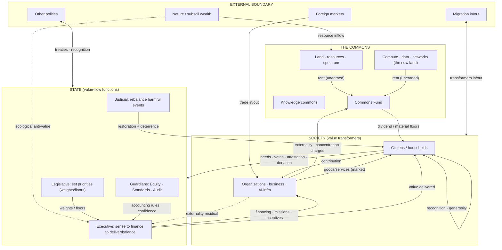

# The Value-Flow Map of the State — Axiacracy is flows, not ministries

| | |
|---|---|
| **Status** | **DRAFT v0.1 — the flow-first reframe** |
| **Point** | Axiacracy describes the **value flows** (to citizens, grouped by direction); **ministries / municipalities are the MOS organs *bound* to those flows**, not doctrine primitives. This is the boundary from `Axiacracy-vs-MOS-Boundary.md`, applied to the apparatus. |
| **Created** | 2026-06-28 |

> The doctrine is a **map of value flows** — sources, sinks, transformers, and the flows between
> them, including the **external boundary** (subsoil/resource inflow, foreign trade in/out, capital,
> migration, knowledge, defense). A *ministry* is simply **an organ assigned to service a flow-domain**;
> MOS binds ministries and municipalities to the flows, but a different Axiacracy could organize the
> same flows differently (one AI servicing several, a council, etc.).

## 1. The reframe — flow-domains are doctrine; organs are implementation
- **A flow-domain** (doctrine) = a direction of value that the state must keep flowing to citizens.
  The flow-domains are essentially the **Æ axes** (economic, educational, scientific, demographic,
  cognitive, infrastructural, social_stability, ecological, meaning, epistemic) **plus cross-cutting
  domains** (fiscal/commons, external relations, defense, emergency, justice).
- **A ministry / municipality** (implementation) = an **organ bound to a flow-domain** to service it.
  MOS binds one per domain; the binding is replaceable.
So the earlier ministry catalogue is best read as **the flow-domains + one (MOS) way to staff them.**

## 2. The three branches as flow-*functions* (not org charts)
Each branch is a **function over the value flows**, grouped by direction:
- **Legislative = priority-setting flows.** Citizens → weights + floors → the value *targets*. The
  flow here is *citizens shaping what counts and how much.*
- **Executive = delivery & balancing flows.** sense → finance → missions/incentives → **value
  delivered to citizens**, across every flow-domain. The flow here is *value reaching citizens and
  being kept in-corridor.*
- **Judicial = rebalancing flows.** harmful event → measure → **restoration + deterrence** → rebalance.
  The flow here is *correcting flows that crossed a harm threshold.*

## 3. The Commons as the fiscal hub
Unearned **rent inflows** (land/resources, compute/data, network-effects) + externality/concentration
charges pool into the **Commons Fund**, which flows out as the **citizen dividend / material floors**
and **strategic financing** (allocated by imbalance × weight × floor, released on citizen attestation).
This is the fiscal circulation of the state.

## 4. The external boundary flows (a state is not a closed system)
| Boundary flow | Direction | Notes |
|---|---|---|
| **Subsoil / natural wealth** | **inflow** (value) + **outflow** (ecological anti-value) | extraction feeds the Commons as rent, but books ecological anti-value |
| **Foreign trade** | **in/out** | imports bring value in; exports send it out; both cross the border |
| **Capital / investment** | **in/out** | subject to the anti-value-liability gate on outflow (no exit to escape liability) |
| **Migration** | **in/out** | value transformers crossing the boundary (citizenship/naturalization gates) |
| **Knowledge / culture** | **in/out** | ideas, science, culture across the border |
| **External relations** | **exchange** | treaties, alliances, foreign-frame recognition (value flows with other polities) |
| **Defense** | **repel** | the boundary against hostile external flows (an attack = anti-value inflow to repel) |

## 5. The VSS — value-system schema of the state
A GitHub-rendered map of the whole value system (actors, flows, boundary):

**Reading it:** value enters from the **external boundary** (resources, trade) and from **citizen
contribution**; **unearned rent** pools in the **Commons Fund**; the **state functions** set priorities
(Legislative), deliver & balance value across the flow-domains (Executive), and rebalance harms
(Judicial); value returns to citizens as **dividend/floors, delivered value, and restoration**;
citizens steer it all through **votes, needs, attestation, and recognition**. Anti-value (dotted) is
priced back onto its source.

## 6. Implementation binding (MOS)
MOS binds a **ministry** to each executive flow-domain and a **municipality** to each territorial
sub-graph, staffs them with validated AI agents, and runs the loop on the Orkestron stack. **Axiacracy
only requires the flows and the functions; MOS chooses the organs.**

## Open items
- A fuller, quantified VSS (flow volumes, corridors per domain) — a first-order artifact for the sim.
- Per-domain source/sink inventories (which transformers feed and draw each flow-domain).
- The external-flow accounting (how trade/capital/migration book onto the Æ axes).
